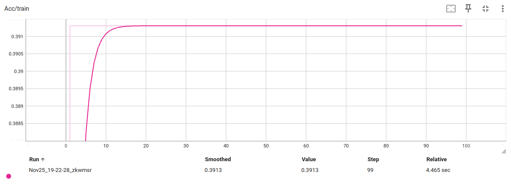
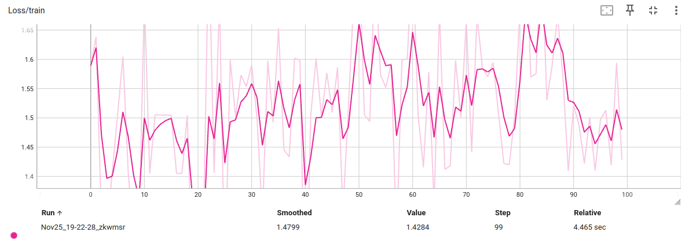

# **MSAI 349: Final Project Preliminary Results - Group 6 (Fall 2024)**  
**Authors**: Zhengyang Kris Weng, Zhengxiao Han, Ben Benyamin  

---

### **Task**  
Our project focuses on classifying everyday objects using point cloud data. To achieve this, we constructed and trained a custom PointNet[1] model for point cloud classification. Additionally, we generated synthetic data for training and testing the model.  

---

### **Results**  
We implemented a simple PointNet model using PyTorch and developed utility scripts to facilitate training and data generation. Below are visualizations of our preliminary training results, generated using TensorBoard:  

#### **Training Accuracy**
  
As shown in the accuracy graph above, training accuracy plateaus around **0.4** and does not improve significantly as epochs progress.  

#### **Training Loss**
  
Similarly, the loss graph does not exhibit a consistent decreasing trend.  

These observations suggest a potential issue in our implementation of the PointNet algorithm. Specifically, we suspect the **T-Net layers** (used to compensate for geometric deviations) may not be functioning correctly between the MLP layers. This hypothesis will be investigated further as the project progresses.  

---

### **Analysis**  
Key observations and next steps:  
- **Model Implementation**: Successfully built a basic PointNet model using PyTorch.  
- **Data Generation**: Created datasets for training and testing.  
- **Training Behavior**: Accuracy shows improvement initially but plateaus at ~0.4. Loss does not decrease consistently.  
- **Suspected Issue**: Potential errors in the T-Net layer implementation between MLP layers.  
- **Next Steps**: Investigate and debug T-Net layer functionality.  

TensorBoard will continue to be used for training visualization as we refine the model.  

---  

[1]R. Q. Charles, H. Su, M. Kaichun and L. J. Guibas, "PointNet: Deep Learning on Point Sets for 3D Classification and Segmentation," 2017 IEEE Conference on Computer Vision and Pattern Recognition (CVPR), Honolulu, HI, USA, 2017, pp. 77-85, doi: 10.1109/CVPR.2017.16. keywords: {Three-dimensional displays;Shape;Computer architecture;Feature extraction;Machine learning;Semantics},

