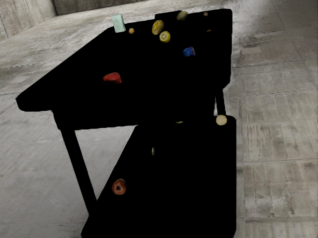
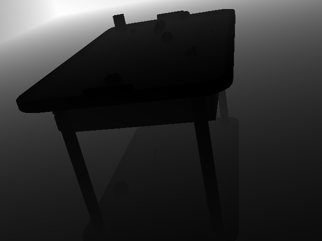
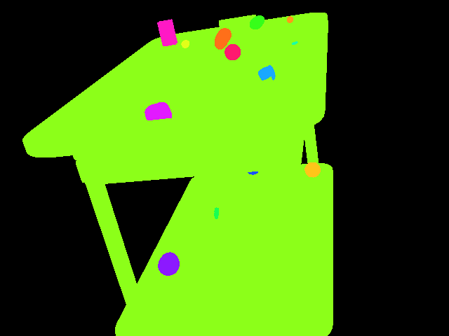
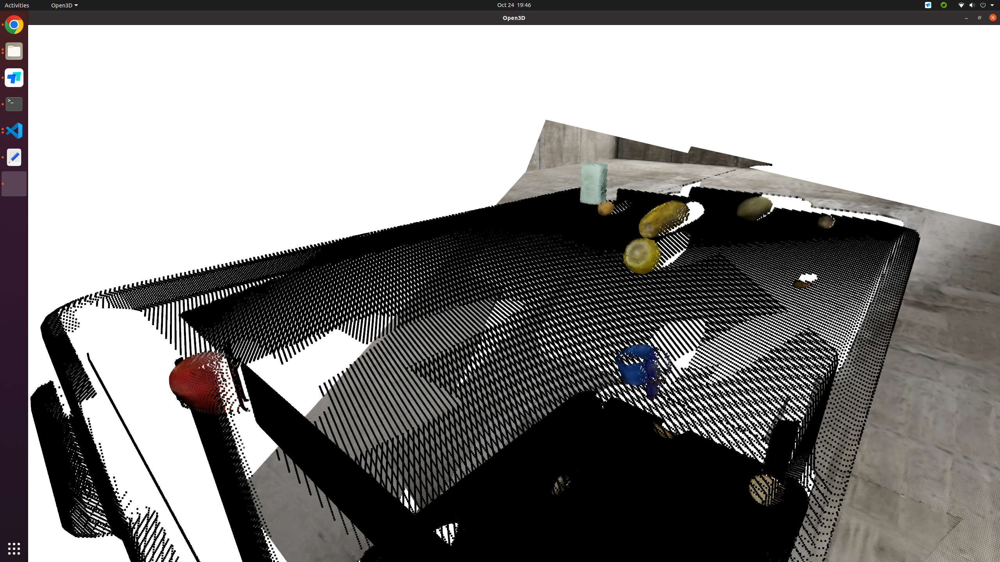
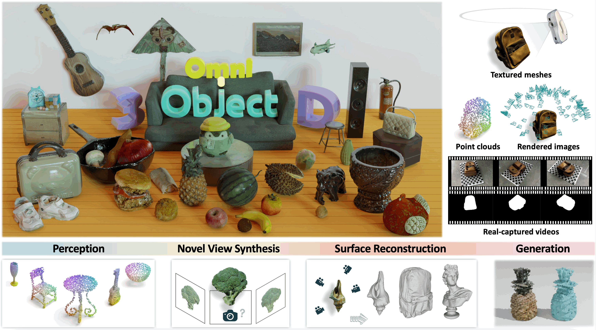
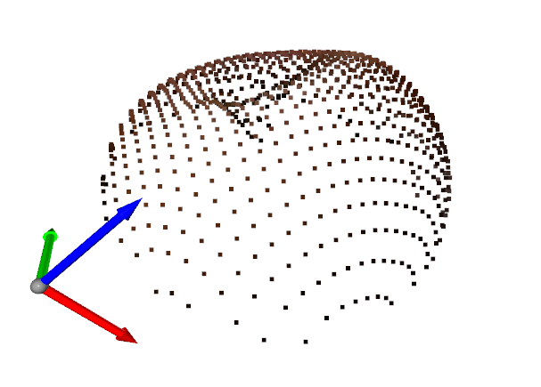

# Final Project Proposal
## 1. Task Description and Motivation
### Task:
Point cloud classification with RGB information.

* Input: A set of 3D points (point cloud), where each point contains its 3D position and RGB values, representing an object.
* Output: The object's class label, chosen from a fixed number of predefined classes (e.g., 10 classes).
### Motivation:
This task is fundamental in robotics, particularly in areas such as autonomous navigation, and robotic manipulation. In many robotic applications, sensors like RGBD cameras provide both geometric (depth) and color (RGB) information, offering a richer dataset for classifying and interacting with objects. The ability to classify objects from RGBD data is critical for tasks like object recognition in cluttered environments or human-robot collaboration in dynamic spaces. With our background in robotics, we see this as a stepping stone for integrating vision-based perception with other robotic tasks, such as grasp planning or scene understanding.

## 2. Data Acquisition
We will generate the dataset using [Isaac Sim](https://docs.omniverse.nvidia.com/isaacsim/latest/index.html), a robotic simulator developed by NVIDIA that can generate photo-realistic synthetic data due to its ray-tracing feature. Here is an example of our dataset (I've already generated more than 100,000 data samples like this before):

* RGB images.
    
    
* Depth images (to be converted into point clouds).

    
* Segmentation masks for each object.

    
* Object labels for every pixel in the RGB and depth images, mapping from  RGBA value to object class.
    * "(0, 0, 0, 0)": {"class": "BACKGROUND"}, 
    * "(140, 255, 25, 255)": {"class": "blender_cabinet_004"}, 
    * "(0, 0, 0, 255)": {"class": "UNLABELLED"}, 
    * "(25, 168, 255, 255)": {"class": "watch_011"}, 
    * "(140, 25, 255, 255)": {"class": "apple_034"}, 
    * "(226, 25, 255, 255)": {"class": "tomato_019"}, 
    * "(255, 25, 197, 255)": {"class": "soap_017"}, 
    * "(25, 82, 255, 255)": {"class": "apple_030"}, 
    * "(255, 154, 25, 255)": {"class": "walnut_003"}, 
    * "(255, 197, 25, 255)": {"class": "biscuit_033"}, 
    * "(255, 111, 25, 255)": {"class": "corn_027"}, 
    * "(25, 255, 82, 255)": {"class": "biscuit_003"}, 
    * "(226, 255, 25, 255)": {"class": "walnut_033"}, 
    * "(255, 25, 111, 255)": {"class": "lemon_008"}, 
    * "(54, 255, 25, 255)": {"class": "potato_005"}, 
    * "(25, 255, 168, 255)": {"class": "biscuit_018"}
* Camera intrinsics for converting depth images into point clouds with corresponding RGB values.
    * Converted pointcloud:
    

By simulating this environment, we ensure that the data generation process is structured, reproducible, and precisely aligned with our project's needs.

## 3. Features and Attributes
The primary feature for this task will be the 3D point cloud enriched with RGB information, representing each object. Each point cloud will consist of points in 3D space, capturing the object's shape, color, and spatial distribution.

## 4. Initial Approach
### Data Generation
This is done by my perious research projects. I collected several object models (scanned from real world) from the [OmniObject3d](https://omniobject3d.github.io/) Dataset. The data generation pipeline in Isaac Sim by utilizing its Replicator has been achieved.

### Data Preprocessing:
Convert depth images into point clouds using the camera intrinsics.
Add corresponding RGB values to each point in the cloud based on the RGB images.
Segment the point cloud by extracting the portion corresponding to each object based on the segmentation masks.

For example, this is the pointcloud of an apple extracted from the data example above:

Use [PointNet](https://github.com/charlesq34/pointnet) to extract representative features from the RGB-enhanced point clouds because it's working well on extracting features from such unorganized (unordered) data.

### Machine Learning Techniques:
The features extracted from PointNet will be passed through an MLP (Multi-Layer Perceptron), which will be trained to classify the objects into their respective categories. We will also explore alternatives to MLP for classification performance, such as decision trees, KNN and K-Means.

### Evaluation:
We will evaluate our model based on classification accuracy, measuring the percentage of correctly classified objects. Additionally, we will conduct ablation study, exploring the impact of incorporating RGB data alongside depth information to understand its contribution to classification performance.
